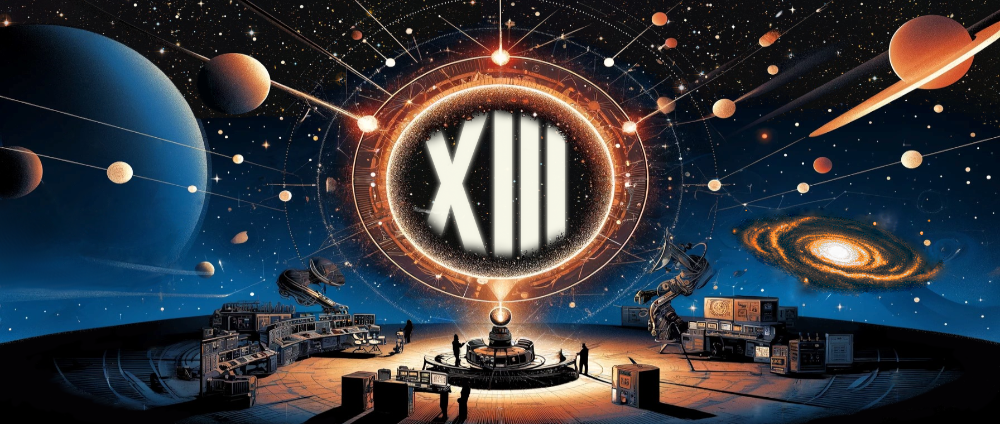

# dotAstronomy 13 

*23rd - 26th April 2024, European Space Astronomy Centre (ESAC), Madrid (SPAIN)*   

**This Github folder serves as template for dotAstronomy 13 hackaton.**  
**Please fork to start a new project (top right corner of this page).**

## Projects  
- **Website for Astronomy Ilustrations** - Agni Banerjee
- **DumBot** - Yago Ascasibar
- **Promoting Bluesky to Astronomers** - Emily Hunt
- **Galaxy sonification (+ VR maybe)** - Coleman Krawczyk
- **Datacube Listener, Live!** - James Trayford
- **dotAstronomy13 soundtrack** - José A. Caballero
- **Astronomy as a Great Tool to Have Impact on Humans in 21st Century** - Shahrzad Mirsoltani
- **Astrotalks: ArXiV for presentations** - David Hendriks
- **Make a search bar** - Mike Walmsley
- **AstroCollab** - Zoe Faes
- **Set up JDaviz example notebooks on datalabs** - Clare Shanahan
- **So you want to be an Astropy contributor?** - Iva Momcheva
- **Redo the software use in astro survey** - Iva Momcheva
- **Getting started ML in astronomy** - Sandor Kruk
- **Adding to the ESASky Virtual Assistant** - Debbie Baines
- **Astro careers, networks, publication stats, etc.** - Iva Momcheva

## Useful links
- [Schedule](https://www.dotastronomy.com/schedule-13)
- [dotAstronomy Slack](https://join.slack.com/t/dotastronomyteam/shared_invite/zt-2eo300ols-PQyNcxo4llv7ijVXgiSEfA)
- [main hackaton folder](https://github.com/ESA-Datalabs/dotAstronomy13)
